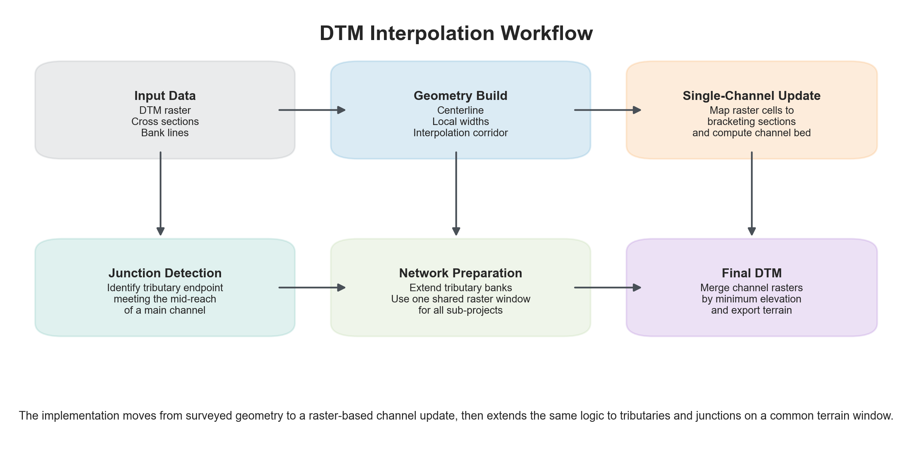
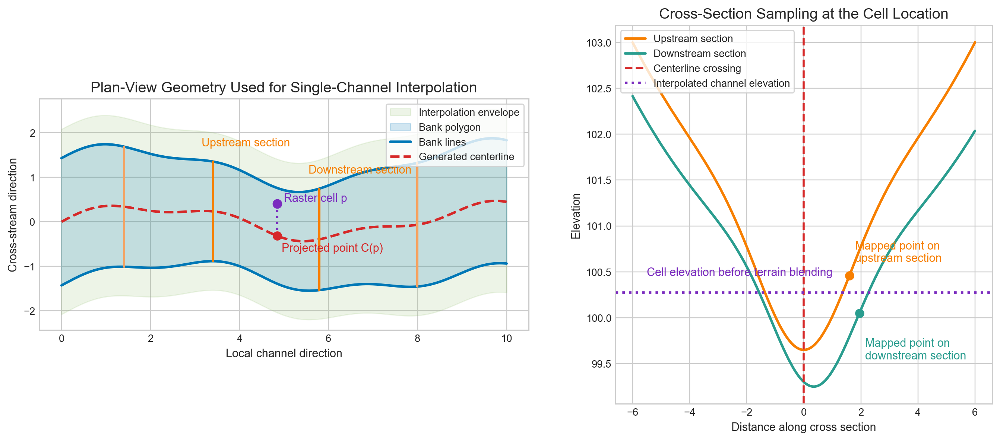
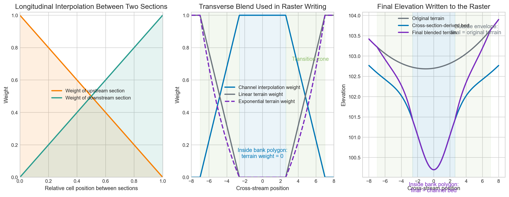
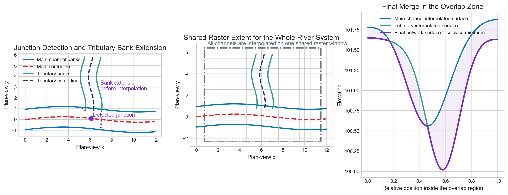

# DTM Interpolation Methodology for 2D HEC-RAS Terrain Preparation

The main goal is to modify the base terrain model so that the surveyed river geometry is better represented inside the channel corridor while still preserving a smooth transition back to the original terrain outside the river. For projects containing tributaries and junctions, the same idea is extended to a full river system so that all channels are handled consistently on one shared terrain window.

---

## 1. General Workflow

The workflow begins with three main data sources:

1. the base DTM raster,
2. the surveyed cross-section points for each channel,
3. the bank line polylines that define the river edges.

For a single channel, the procedure is:

1. extract and resample a local terrain window around the survey,
2. derive a mathematical centerline from the two banks,
3. construct a dynamic interpolation corridor from the surveyed cross-sections,
4. compute a new channel elevation for each raster cell inside that corridor,
5. blend the new channel elevation with the original terrain.

For a river network with tributaries:

1. repeat the centerline construction for each sub-project,
2. detect possible junctions from the geometry of those centerlines,
3. extend tributary banks toward the main channel at the junction,
4. interpolate each channel on the same raster extent,
5. merge the resulting channel terrains into one final DTM.

The important design choice is that the method remains cross-section driven. The terrain is not arbitrarily carved; it is reshaped so that the final raster follows the surveyed cross-sectional geometry as closely as possible while keeping the surrounding floodplain terrain smooth and stable.

---

## 2. Terrain Window Extraction and Resampling

The first step is to determine the part of the terrain raster that needs to be modified. This is done by reading the full set of surveyed cross-section points for a channel and computing their overall spatial extent. A buffer is then added around that extent so that the processing window includes both the channel and a surrounding transition zone.

The raw DTM is then cropped to this local window and resampled to the target computational resolution. This step is important because the survey data often represent the channel geometry in much more detail than the original terrain raster. By resampling the local raster to a finer resolution, the later interpolation steps can fit the surveyed geometry into the terrain more smoothly.

In practice, this means the workflow does not modify the entire terrain model at once. It works on a focused raster window that is just large enough to contain the channel geometry and the blending zone around it.

---

## 3. Centerline Generation from the Bank Lines

The method does not require a predefined river centerline. Instead, the centerline is generated mathematically from the two bank lines. The idea is simple: at many locations along one bank, the method finds the corresponding location on the opposite bank and then computes the point that lies equally between them. Repeating this along the channel produces a centerline that stays centered between the two banks even where the channel bends.

This is important because the centerline acts as the backbone of the whole interpolation system. Once the centerline is defined, every raster cell in the river corridor can be described by:

1. its position along the river, and
2. its offset away from the centerline.

That converts the DTM modification problem into a river-based coordinate system rather than a purely Cartesian one.

The same centerline is also used to estimate the local river width. At each centerline location, the width is taken as the sum of the distances from the centerline to the left and right banks. This makes the method responsive to changes in channel width along the river.

---

## 4. How the Surveyed Cross-Sections Are Used

Each surveyed cross-section is treated as a 3D line. The cross-section is first connected to the centerline by identifying the point on the section that lies closest to the centerline. That point acts as the local channel reference point for the section.

Once this reference is known, the section is split conceptually into a left side and a right side. The elevation along the section is then represented as a continuously interpolated function of distance along the section. In other words, the discrete surveyed points are converted into a smooth profile that can be sampled at any intermediate location.

This is a key part of the workflow: the terrain is not simply forced to match one surveyed point at a time. Instead, each cross-section becomes a continuous elevation profile that can be sampled wherever a raster cell maps onto it.

The method also stores where each cross-section lies along the centerline. That allows the workflow to identify, for any raster cell, which two surveyed sections lie immediately upstream and downstream of it.

---

## 5. Construction of the Interpolation Corridor

The river corridor used for interpolation is not taken directly from the bank polygon alone. Instead, a wider and more flexible interpolation envelope is built from the surveyed cross-sections themselves.

At every location along the centerline, the left and right extents of the channel are estimated by interpolating the left and right half-widths of the surveyed cross-sections. These interpolated widths are then traced outward from the centerline using the local normal direction of the river. Connecting those left and right traces creates a dynamic polygon around the river.

This polygon plays two roles:

1. it limits the area over which cross-section-based terrain modification is allowed,
2. it defines the outer boundary of the blending zone.

Because this polygon follows the cross-section widths, it adapts much better to natural widening, narrowing, and curvature than a fixed-distance buffer would.

---

## 6. Cellwise Interpolation Inside a Single Channel

After the terrain window, centerline, and interpolation corridor are defined, the workflow evaluates the raster cell by cell inside the corridor.

For each raster cell, the following logic is used.

First, the cell is projected onto the centerline. This gives the local river chainage and the nearest point on the centerline. The perpendicular distance from the cell to that projected centerline point is then computed. That distance represents how far the cell lies away from the centerline.

Second, the workflow identifies the two surveyed cross-sections that bracket the cell in the longitudinal direction. One is the nearest section upstream, and the other is the nearest section downstream. These two sections provide the local geometric control for the cell.

Third, the transverse offset of the cell from the centerline is mapped onto each of the two bracketing sections. This mapping is scaled by the ratio between the local channel width at the cell and the width represented by each section. That scaling is important because it allows a cell to be mapped consistently even when the channel width changes between two surveyed sections.

Fourth, the mapped positions on the upstream and downstream sections are used to sample elevations from those sections. Those two elevations are then blended together using inverse-distance weighting, so the section that is geometrically closer to the cell has greater influence.

The result of this stage is a cross-section-derived channel elevation for the raster cell.

This is the heart of the method: every cell is assigned a new river-consistent elevation by combining the geometry of the nearest upstream and downstream surveyed sections.

---

## 7. Blending with the Original Terrain

The channel elevation computed from the cross-sections is not written directly into the terrain everywhere. Instead, it is blended with the original DTM so that the modified terrain transitions smoothly into the natural surrounding ground.

Two geometric masks are used:

1. the bank polygon, which represents the core channel zone,
2. the larger interpolation envelope, which represents the outer transition zone.

The implementation treats the bank polygon as the zone where the channel geometry is already fully trusted. For raster cells that fall inside this bank region, the written elevation is the same as the cross-section-derived bed elevation. Once a cell lies outside the bank polygon but still inside the larger interpolation envelope, the workflow starts blending gradually back toward the original DTM. Near the outer edge of the interpolation envelope, the original terrain becomes dominant. This creates a gradual rather than abrupt transition.

An optional exponential version of the terrain weight is also available. This changes the shape of the fade curve and can make the transition softer where needed.

From a hydraulic perspective, this is very useful: the channel interior follows the surveyed geometry, but the floodplain outside the river is not distorted unnecessarily.

---

## 8. Extension to Tributaries and Junctions

For river systems with multiple sub-projects, the workflow treats each sub-project as a channel candidate. A centerline is built for each one. The method then checks whether an endpoint of one centerline falls close to the middle portion of another centerline. If this happens within the specified tolerance, the geometry is treated as a potential tributary-to-main-channel junction.

The test is directional in the sense that it looks for a tributary endpoint meeting the middle of another river rather than simply any two lines coming close together. This helps distinguish true junctions from cases where channels merely start or end near each other.

Once a junction is identified, the tributary bank lines are extended toward the corresponding main-channel banks. The extension is not arbitrary. The method evaluates the possible ways of pairing the two tributary banks to the two main banks and chooses the pairing that gives the smallest total connection distance. Each tributary bank is then extended to the nearest point on its assigned main bank.

This step improves the geometry in the junction area before any raster interpolation is carried out. The result is a smoother bank topology and a cleaner flow transition when the terrain is later modified.

---

## 9. Shared Raster Processing for the Full River System

When multiple channels belong to one project, the workflow does not process them on separate raster windows and then try to stitch them together afterward. Instead, it first computes one common raster extent that covers all channel survey data and all processed bank geometries.

Each channel is then interpolated on this same raster grid. This is an important implementation choice because it guarantees:

1. identical raster alignment for all channels,
2. direct cell-by-cell comparison between channels,
3. consistent handling of overlap zones near junctions.

This shared-grid approach makes the later merge mathematically clean and avoids mismatch caused by different raster origins, extents, or resolutions.

---

## 10. Final Channel Merge for Junction Areas

After each channel has been interpolated on the common raster window, the workflow combines all of the channel rasters into one final terrain. In overlap regions, the final value at each raster cell is taken as the minimum of the elevations computed from the participating channels.

This minimum-elevation merge is used because the hydraulically controlling channel bed in a junction region is the deepest locally plausible one. In other words, if two interpolated channel surfaces overlap, the method keeps the lower bed elevation rather than averaging the two beds together.

That produces a more physically meaningful final terrain in confluence areas and helps avoid raised or blocked junction geometry.

---

## 11. Summary

In practical terms, the workflow can be summarized as follows:

The surveyed cross-sections provide the most reliable information about the interior of the channel, so they are used to reconstruct the river bed and inner channel shape. The original DTM provides the best representation of the surrounding ground, so it is preserved outside the river corridor. A distance-based blending procedure then connects those two surfaces smoothly.

For tributary systems, the same logic is extended by first making the channel geometries consistent at the junction, then interpolating all channels on one raster, and finally merging them in a way that preserves the deepest valid channel representation.

---

## 12. Supplementary Mathematics

The equations below summarize the key computational relationships used in the implementation.

### 12.1 Terrain Window

If the surveyed points are $\{(x_i,y_i,z_i)\}_{i=1}^N$ and the processing buffer is $b$, then the cropped terrain window is:

$$
\Omega
=
\left[
\min_i(x_i)-b,\;
\min_i(y_i)-b,\;
\max_i(x_i)+b,\;
\max_i(y_i)+b
\right]
$$

If the resampled terrain resolution is $\Delta$, then the working raster dimensions are:

$$
n_x = \left\lfloor \frac{W}{\Delta} \right\rfloor,
\qquad
n_y = \left\lfloor \frac{H}{\Delta} \right\rfloor
$$

### 12.2 Centerline Between the Banks

For two bank lines $B_1$ and $B_2$, a point along one bank is $p_A(s)$ and the nearest point on the opposite bank is $p_B(s)$. The centerline point is found on the segment joining them:

$$
c(s,t) = p_A(s) + t\left(p_B(s)-p_A(s)\right), \qquad t \in [0,1]
$$

with:

$$
t^\ast
=
\arg\min_{t \in [0,1]}
\left|
d\!\left(c(s,t), B_1\right) - d\!\left(c(s,t), B_2\right)
\right|
$$

so that:

$$
C(s)=c(s,t^\ast)
$$

### 12.3 Local Channel Width

At centerline chainage $s$, the local channel width is interpolated from the centerline-to-bank distances:

$$
w(s) = d(C(s), B_L) + d(C(s), B_R)
$$

### 12.4 Cellwise Cross-Section Interpolation

For a raster cell $p$, let its projected centerline chainage be:

$$
s(p)=\operatorname{proj}_{C}(p)
$$

and let its transverse offset from the centerline be:

$$
r(p)=\|p-C(s(p))\|
$$

If the cell lies between bracketing sections $S_k$ and $S_{k+1}$, then the offset is mapped to each section as:

$$
m_k(p)=r(p)\,\frac{w_k^\ast}{w(p)},
\qquad
m_{k+1}(p)=r(p)\,\frac{w_{k+1}^\ast}{w(p)}
$$

The corresponding sampled elevations are:

$$
\hat z_k(p)=z_k\!\left(d_k^C+\sigma_k(p)\,m_k(p)\right)
$$

$$
\hat z_{k+1}(p)=z_{k+1}\!\left(d_{k+1}^C+\sigma_{k+1}(p)\,m_{k+1}(p)\right)
$$

where $\sigma_k(p)$ and $\sigma_{k+1}(p)$ indicate whether the mapped point falls to the left or right of the centerline crossing on each section.

The longitudinal interpolation weights are:

$$
\alpha_k(p)=\frac{\delta_{k+1}(p)}{\delta_k(p)+\delta_{k+1}(p)},
\qquad
\alpha_{k+1}(p)=\frac{\delta_k(p)}{\delta_k(p)+\delta_{k+1}(p)}
$$

so the cross-section-derived channel elevation becomes:

$$
Z_{\text{XS}}(p)
=
\alpha_k(p)\,\hat z_k(p)
+
\alpha_{k+1}(p)\,\hat z_{k+1}(p)
$$

### 12.5 Terrain Blending

Let $\widetilde d_B(p)$ be a bank-core distance term that is zero inside the bank polygon and increases only after the cell moves outside that bank region but remains within the interpolation envelope. Let $d_X(p)$ be the distance to the outer interpolation envelope boundary:

$$
\widetilde d_B(p)
=
\begin{cases}
0, & p \in \Omega_B \\
d(p,\Omega_B), & p \in \Omega_{\text{XS}} \setminus \Omega_B
\end{cases}
$$

Then:

$$
\beta_{\text{terrain}}(p)
=
\frac{\widetilde d_B(p)}{\widetilde d_B(p)+d_X(p)}
$$

$$
\beta_{\text{XS}}(p)=1-\beta_{\text{terrain}}(p)
$$

Therefore, inside the bank polygon:

$$
p \in \Omega_B
\;\Rightarrow\;
\beta_{\text{terrain}}(p)=0
\;\Rightarrow\;
Z_{\text{final}}(p)=Z_{\text{XS}}(p)
$$

Outside the interpolation envelope, the original terrain is retained:

$$
p \notin \Omega_{\text{XS}}
\;\Rightarrow\;
Z_{\text{final}}(p)=Z_{\text{DTM}}(p)
$$

The final modified elevation for a single channel is:

$$
Z_{\text{final}}(p)
=
\beta_{\text{terrain}}(p)\,Z_{\text{DTM}}(p)
+
\beta_{\text{XS}}(p)\,Z_{\text{XS}}(p)
$$

If exponential blending is used, the terrain weight is transformed as:

$$
\beta_{\text{terrain}}^{(\exp)}(p)
=
\frac{e^{\beta_{\text{terrain}}(p)}-1}{e-1}
$$

### 12.6 Junction Detection

For a tributary endpoint $e$ and a main-channel centerline $C_m$:

$$
s_m(e)=\operatorname{proj}_{C_m}(e)
$$

$$
j(e)=C_m\!\left(s_m(e)\right)
$$

$$
\eta(e)=\frac{s_m(e)}{L_m},
\qquad
d_J(e)=\|e-j(e)\|
$$

A valid junction candidate must satisfy:

$$
0.05 \le \eta(e) \le 0.95,
\qquad
d_J(e)\le\tau_J
$$

### 12.7 Network Merge

If $Q$ channels are interpolated on the same raster grid, then the final river-system terrain is:

$$
Z_{\text{net}}(p)=\min_{q=1,\dots,Q} Z_q(p)
$$

This minimum operation is applied cellwise after ignoring `nodata` cells.

---

