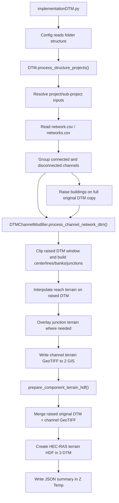

# Modular DTM Package Flow

This note explains how the DTM implementation is now organized after moving the
large `Automation/DTM.py` and `Automation/callDTM.py` logic into the
`Automation/DTM/` package.

## Package Layout

| File | Responsibility |
| --- | --- |
| `Automation/DTM/__init__.py` | Public package API. Exposes `DTM`, `DTMChannelModifier`, and terrain-HDF helpers. |
| `Automation/DTM/controller.py` | Project-level orchestration. Resolves config paths, groups river components, runs interpolation, and prepares HEC-RAS terrain HDFs. |
| `Automation/DTM/channel_modifier.py` | Backwards-compatible `DTMChannelModifier` facade assembled from focused mixins. |
| `Automation/DTM/core.py` | CSV loading, DTM raster-window preparation, legacy single-channel setup, and cell-centerline metrics. |
| `Automation/DTM/geometry.py` | Cross-section geometry, skewness correction, centerline pivot logic, bank widths, and lateral-distance mapping. |
| `Automation/DTM/interpolation.py` | Reach interpolation, junction interpolation, raster overlay, transition blending, and network terrain assembly. |
| `Automation/DTM/network.py` | Channel-network construction, network.csv reading, junction detection, tributary extension, and DTM grouping helpers. |
| `Automation/DTM/exports.py` | GeoTIFF writing, shapefile exports, bank polygons, study perimeter clipping, connected-bank products, and building lift. |
| `Automation/DTM/bank_vectors.py` | Bank-line cleaning/merging, centerline generation, bank offsets, cross-section masks, and vector utility exports. |
| `Automation/DTM/terrain_hdf.py` | Creates the building-raised original DTM, merges it with interpolated channel terrain, and creates HEC-RAS terrain HDF in `3 DTM`. |
| `Automation/DTM/models.py` | Small shared dataclasses such as `TerrainHdfResult`. |
| `Automation/callDTM.py` | Compatibility shim for older imports: `from Automation.callDTM import DTM`. |

## Execution Flow

## Main Runtime Steps

1. `implementationDTM.py` builds a folder-only `Config` and calls `DTM`.
2. `DTM` reads all selected projects from `1 Bur-Bur`.
3. For each sub-project, `Config.get_sub_project_paths()` resolves:
   - `*KESIT_TESLIM*.csv`
   - `*SEV_USTU*.shp`
   - the correct source DTM from `0 Essentials/dtm.csv` and `0 Essentials/DTMs`
4. `DTM.group_connected_channel_inputs()` groups rivers using `network.csv` or `networks.csv`.
5. `prepare_building_raised_original_dtm()` copies the full source DTM to
   `3 DTM/Raised_Originals` and raises building-covered cells before any clipping.
6. `DTMChannelModifier.process_channel_network_dtm()` prepares the interpolated terrain using the raised DTM:
   - Reads and resamples the DTM window.
   - Builds centerlines from bank lines.
   - Applies skewness correction when enabled.
   - Interpolates individual reaches.
   - Applies junction interpolation/overlay for connected rivers.
   - Exports GIS products such as centerlines, bank polygons, merged banks, perimeter, and channel terrain.
7. `prepare_component_terrain_hdf()` copies the raised original DTM, overlays valid interpolated channel cells, then creates the HEC-RAS terrain HDF.

The terrain-HDF step uses the projection file `0 Essentials/TUREF_CM30_projection.prj`
by default. If that exact file is not present, the controller searches
`0 Essentials` for `*projection*.prj`, then any `.prj` file.

## Output Locations

| Output Type | Folder |
| --- | --- |
| Input essentials, DTM index, original DTMs | `0 Essentials` |
| Raw project/sub-project data | `1 Bur-Bur` |
| GIS outputs and interpolated channel GeoTIFFs | `2 GIS` |
| Merged terrain GeoTIFFs and HEC-RAS terrain HDFs | `3 DTM` |
| HEC-RAS projects | `4 HECRAS` |
| Model deliverables and computed runs | `5 Deliverables` |
| Summaries, intermediate rasters, temporary files | `Z Temp` |

## Compatibility Notes

- Existing code can still use `from Automation.callDTM import DTM`.
- New code should prefer `from Automation.DTM import DTM, DTMChannelModifier`.
- The public `DTMChannelModifier` method names are intentionally preserved.
- `Aayush/rasmapper_v01.py` is not used or modified by this DTM package.
